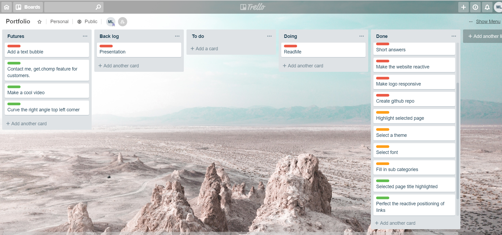

# My portfolio
Term1 HTML/CSS - assignment

## Developers
- Mitchell Leffers

[Direct link to Portfolio github](https://github.com/Leffers90/Portfolio)

## Contents
#### 1. Purpose
#### 2. Functionality
#### 3. Developer brainstorming
#### 4. Workflow diagram
#### 5. Project plan & timeline - Trello screenshots

## 1. Purpose
To have an online presence and to best demonstrate the type of person I am in a quick and effective manner.

## 2. Functionality
Using HTML/ CSS only I wanted the website to have some core attributes which I have been able to complete within the time frame.
These being site navigation, visual appealing, simplicity, and easy to navigate. The website contains four HTML files and 1 css.
This is to load into different pages depending on which tab the user has selected. I have also made the website reactive for multiple screen resolutions.

## 4. Developer brainstorming
After the first assignment I took a huge lesson to not over commit myself to an unrealistic project size. I use youtube alot whilst commuting and in doing so,
I had come across a few different designs and or parts of a website which appealed to me. Using a few of these ideas I came up with a very simple design which was achievable and gave a professional feeling.

## 6. Workflow diagram

## 7. Project plan & timeline - Trello screenshots
I utilised Trello from the get go and constantly added or relocated/ prioritised certain jobs. I used a simple, green, orange, red to prioritise importance of tasks.

##### *Image of how I setup Trello*

